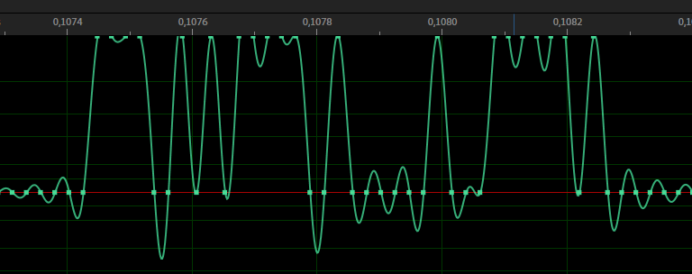
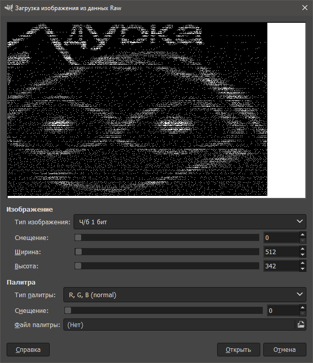

## Таск: DURKA.mp3
_Что ты получишь, если смешаешь психически больного одиночку с обществом, которое игнорирует его и обращается с ним как с мусором? Ты получишь этот файл_

При воспроизведении файлы слышны сильные шумы. Посмотрим на файл в любой программе для просмотра waveform.
  
  

В нормальном аудиофайле такие резкие скачки недопустимы. Предположим, что это бинарный код.
  
```python
import numpy as np
import wavio

a = wavio.read("task.wav").data
print(a)
print(np.amax(a), np.amin(a))
b = (a == 32767).flatten()
s = np.packbits(b).tobytes()
open("data.bin", "wb").write(s)
```
Один из способов визуализации данных это представление в виде bitmap. Попробуем повертеть файл в GIMP-е. При выборе типа изображения как RGB наблюдается очевидный период, но данные выглядят хаотично. Пробуем представить в режиме ч\б 1 бит. Период всё ещё присутствует, но это выглядит менее хаотично, подбираем ширину изображения до тех пор пока не получим осмыслимые данные.  
 


Ширина = 512.
Экспортируем картинку. Замечаем, что в картинке есть полностью черные строки и строки с белыми пикселями. Экспортируем белые строки как 1, черные как 0.

```python
b = np.resize(b, (342, 512))  # Кадрируем
s = ''.join([("1" if np.sum(i) else "0") for i in b])  # Делаем бинарную строку

while len(s) % 8:  # Добавляем до длинны = 8
    s += "0"

print(s) # Выводим

import bitstring
print(bitstring.BitArray(bin=s).bytes)  # декодируем
```

Ответ: flag{ti_kak_smiritelnuy_rubashku_snyal}